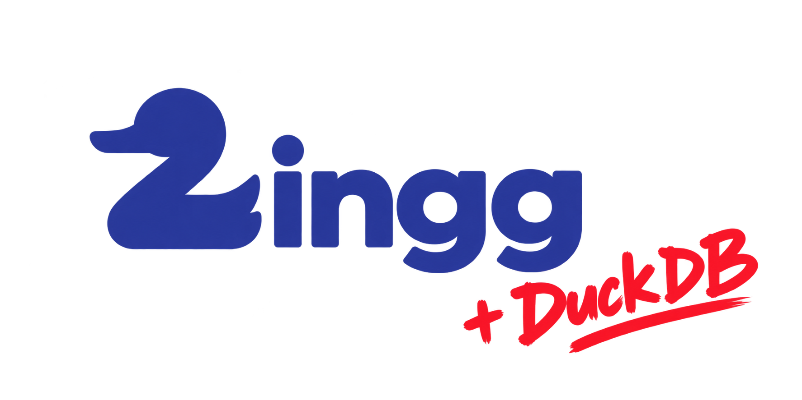
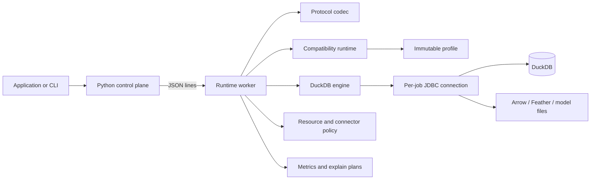
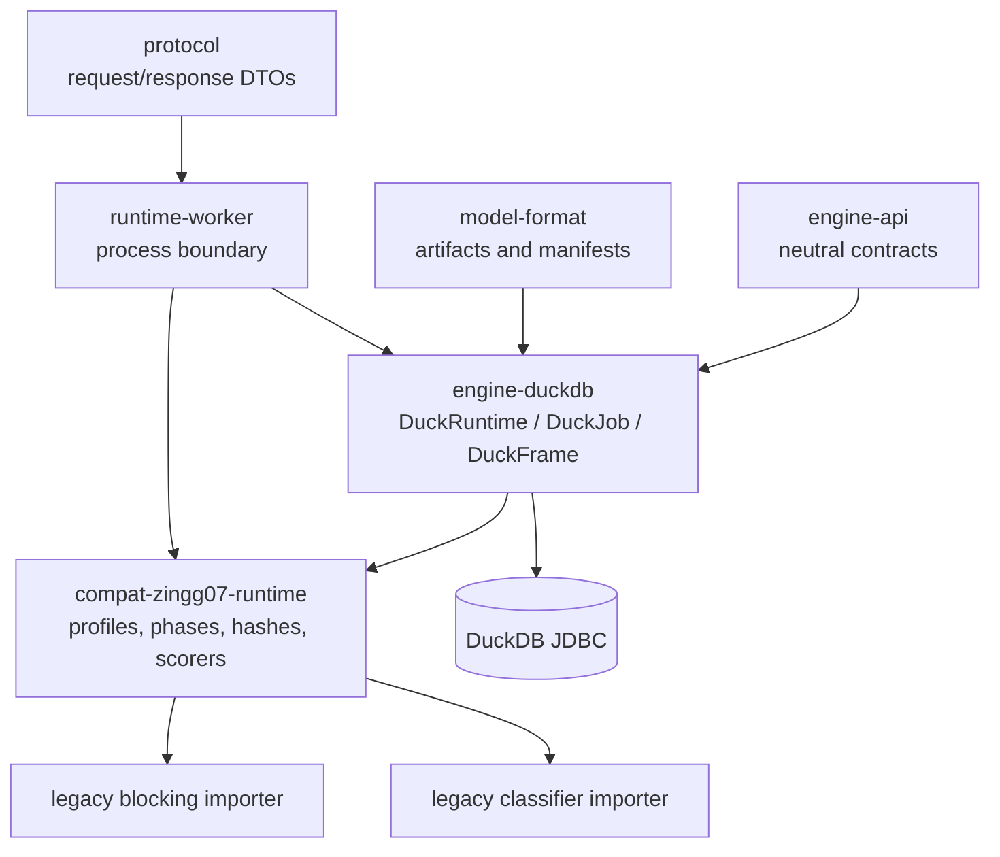
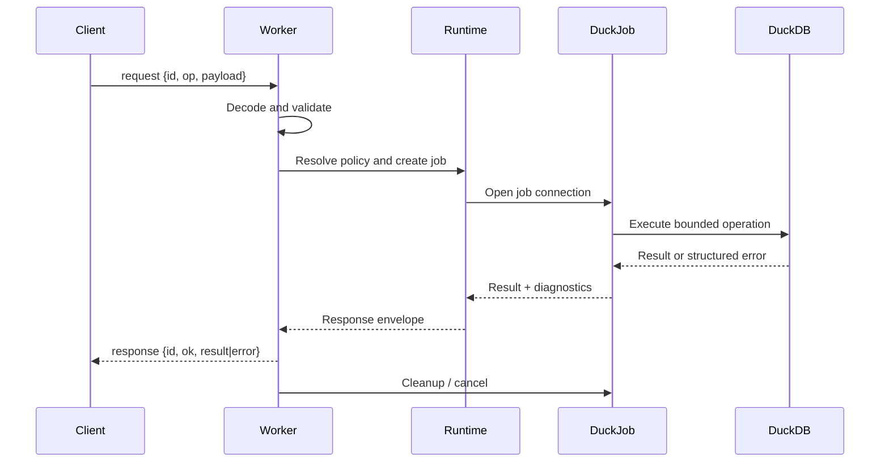

# Zingg DuckDB

> A standalone, embeddable DuckDB execution backend for Zingg 0.7-compatible entity-resolution workflows.



Zingg DuckDB gives a Python-friendly control plane a durable Java/DuckDB data plane. It preserves jobs, frames, phases, model artifacts, compatibility functions, graph outputs, and legacy imports while replacing Spark-bound execution with a local, resource-bounded DuckDB runtime.

## Design principles

- **Job isolation:** each job owns its JDBC connection, temporary relations, registrations, cancellation state, and cleanup lifecycle.
- **Explicit compatibility:** Zingg 0.7 behavior is represented by immutable profiles and scoped registries.
- **Safe local execution:** connector policy, SQL validation, resource limits, offline mode, and extension policy are explicit.
- **Thin orchestration boundary:** Python coordinates work; Java and DuckDB execute data-intensive operations.
- **Portable delivery:** the worker runs from a shaded JAR or a distribution bundle with its own JRE.

## System at a glance



## Quick start

Requires Java 21. Python 3.10+ is required for the control-plane client.

```powershell
./mvnw.cmd package
'{"id":"demo-1","op":"ping"}' | java -jar runtime-worker/target/runtime-worker-0.1.0-SNAPSHOT.jar
```

Build and verify a deployable bundle:

```powershell
./packaging/package.ps1 -Output dist -CreateJre
./packaging/verify-package.ps1 -Bundle dist/zingg-duckdb-0.1.0 -RequireJre
```

Use the Python client:

```powershell
$env:PYTHONPATH = "python"
python -c "from zingg_duckdb import WorkerClient; c=WorkerClient(); print(c.ping()); c.close()"
```

## Architecture



`DuckRuntime` owns the database instance. Each `DuckJob` owns a duplicated JDBC connection, and every `Frame` carries that owner identity. Temporary tables, UDFs, Arrow registrations, SQL statements, and cancellation handles therefore remain job-local.

## Request lifecycle



## Repository map

| Area | Responsibility |
| --- | --- |
| `engine-api` | Neutral runtime, frame, job, connector, cancellation, and diagnostic contracts |
| `engine-duckdb` | DuckDB implementation, SQL, Arrow ingestion, graph operations, UDFs, benchmarks |
| `model-format` | Portable model artifacts, manifests, provenance, and import limits |
| `protocol` | Versioned line-oriented request/response messages |
| `compat-zingg07-runtime` | Profiles, phases, hashes, and similarity functions |
| `runtime-worker` | Executable boundary, validation, limits, and structured errors |
| `python` | Python control-plane client and workflow helpers |
| `legacy-*` | Isolated compatibility importers for legacy artifacts |
| `packaging` | Distribution assembly and verification |
| `fixtures` / `benchmarks` | Deterministic fixtures and performance harnesses |

## Capabilities

- Frames, bounded SQL, read-only `EXPLAIN`, and explicit output limits.
- Arrow IPC/Feather scalar ingestion for boolean, numeric, date, timestamp, and string fields.
- Deterministic graph transitive closure and graph-derived outputs.
- Scoped hash and similarity registries with immutable profiles.
- Manifest-based model artifacts with provenance and import-limit enforcement.
- Offline-by-default connectors, extension allowlisting, memory/temp/spill/output/row/model budgets, cancellation, and timeouts.
- Explain plans, resource snapshots, profiling capture, and structured error envelopes.

## Configuration and safety defaults

Supported worker options include `--memory-bytes`, `--max-temp-bytes`, `--max-spill-bytes`, `--max-collect-bytes`, `--max-output-bytes`, `--max-rows`, `--max-model-bytes`, `--max-jobs`, `--offline`, and `--allow-extension`. The default connector policy is offline and extensions are disabled. Arbitrary diagnostic `count`/`explain` SQL is disabled by default; use `--unsafe-debug-sql` only in a controlled diagnostic process.

## Validation and performance

```powershell
./mvnw.cmd test
$env:PYTHONPATH = "python"; $env:PYTHONWARNINGS = "error"
python -m unittest discover -s python/tests -v
```

`BenchmarkMain` reports startup/shutdown, SQL aggregation, and graph closure independently. See [benchmarks/README.md](benchmarks/README.md) and [validation status](docs/validation-status.md).

## Documentation map

- [Documentation hub](docs/README.md)
- [Architecture](docs/architecture.md)
- [Worker protocol](docs/worker-protocol.md)
- [Compatibility profiles](docs/compatibility-profiles.md)
- [Model format](docs/model-format.md)
- [Legacy import](docs/legacy-import.md)
- [Operations runbook](docs/operations-runbook.md)
- [Profiling](docs/profiling.md)
- [Migration guide](docs/migration-guide.md)
- [Validation status](docs/validation-status.md)
- [Build plan](build-plan.md) · [Test plan](test-plan.md)

## Status, license, and notices

The implementation, test, packaging, worker-smoke, lifecycle, and benchmark infrastructure is present. See [validation-status.md](docs/validation-status.md) for executed evidence and remaining environment-dependent gates. See [LICENSE](LICENSE) and [NOTICE.md](NOTICE.md) for legal and third-party notices.
