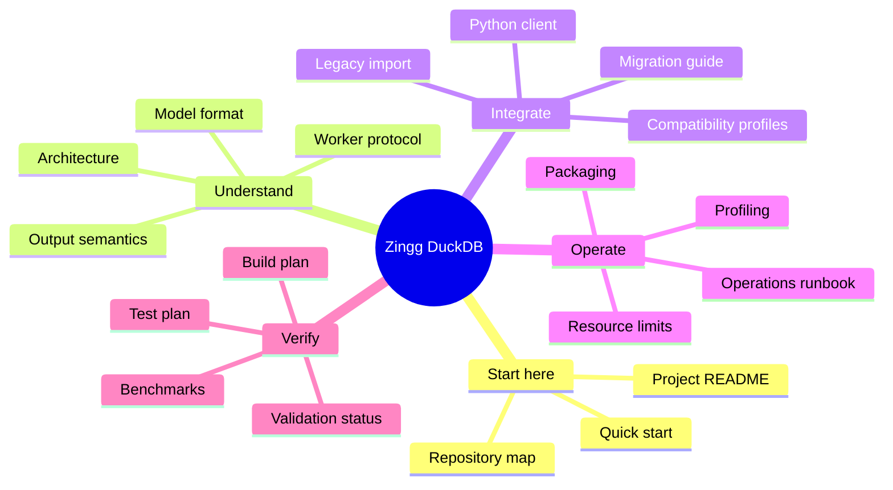
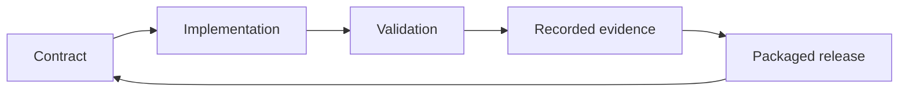

# Documentation hub

This is the canonical map of the Zingg DuckDB documentation.

## Recommended reading paths

### New user

1. [Project README](../README.md)
2. [Worker protocol](worker-protocol.md)
3. [Operations runbook](operations-runbook.md)

### Integrator

1. [Architecture](architecture.md)
2. [Compatibility profiles](compatibility-profiles.md)
3. [Model format](model-format.md)
4. [Migration guide](migration-guide.md)

### Operator or release engineer

1. [Packaging](../packaging/README.md)
2. [Operations runbook](operations-runbook.md)
3. [Profiling](profiling.md)
4. [Validation status](validation-status.md)

### Contributor

1. [Build plan](../build-plan.md)
2. [Test plan](../test-plan.md)
3. [Architecture](architecture.md)
4. [Benchmarks](../benchmarks/README.md)

## Cross-cutting mental model

Every feature should have a contract, an implementation boundary, an executable validation path, and a recorded operational or release consequence.
